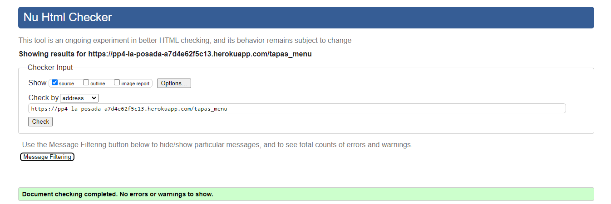
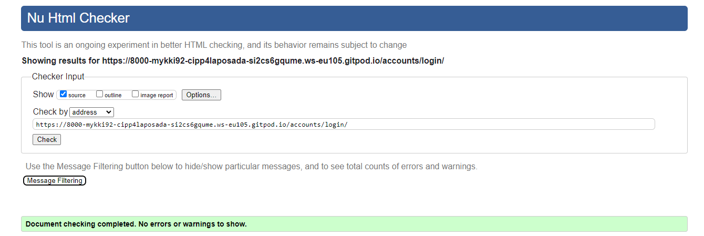
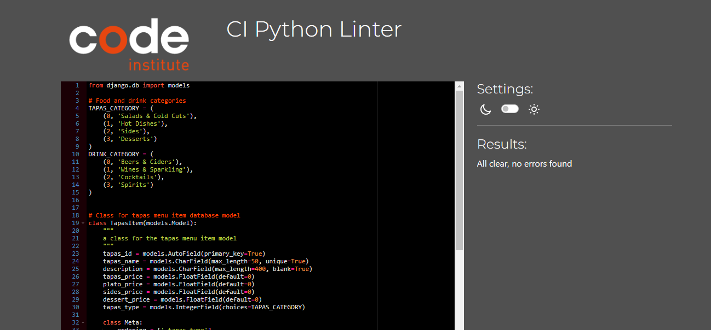
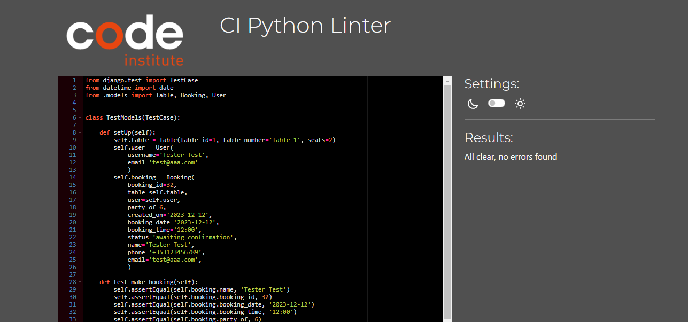
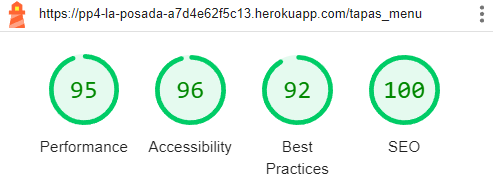
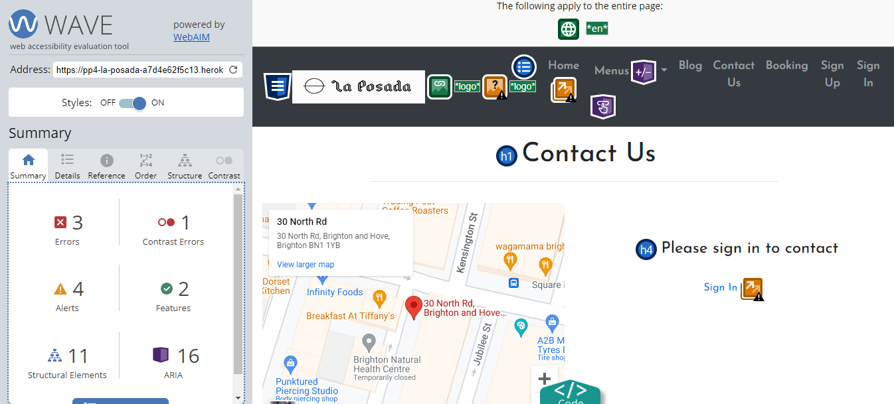
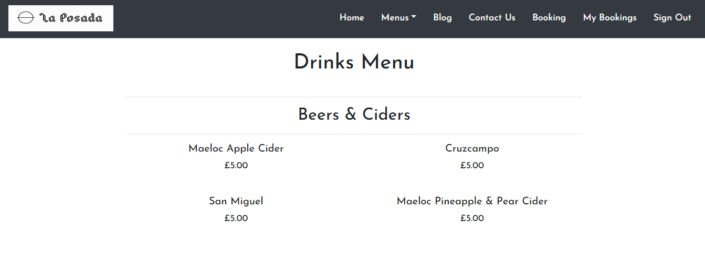
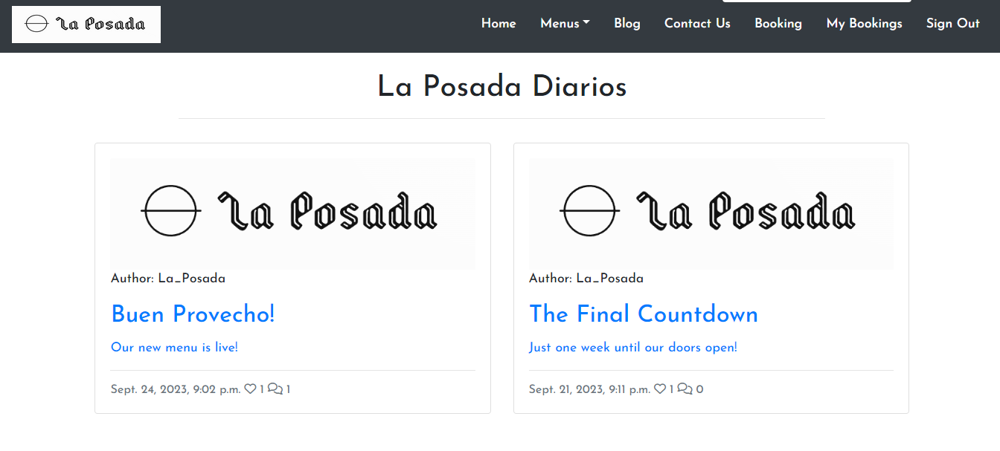

# **La Posada**
Developed by Michael Roberts

💻 [Visit live website](https://pp4-la-posada-a7d4e62f5c13.herokuapp.com/)  
(Ctrl + click to open in new tab)

## Introduction
La Posada is a fictional tapas restaurant in Brighton, England. This website aims to give users an overview of the restaurant and the food and drink available, provide contact details for customers to give feedback and a booking system for users to make reservations, and run a blog where users can stay updated and interact with the restaurant and other users.

## Table of Contents
* [Project Goals](#project-goals)
    * [User Goals](#user-goals)
    * [Site Owner Goals](#site-owner-goals)
* [User Experience](#user-experience)
    * [Target Audience](#target-audience)
    * [User Requirements](#user-requirements)
* [User Stories](#user-stories)
    * [User](#user)
    * [Admin/Authorised User](#admin/authorised_user)
    * [Site Owner](#site_owner)
* [Design](#design)
    * [Colours](#colours)
    * [Fonts](#fonts)
    * [Structure](#structure)
        * [Website Pages](#website-pages)
        * [Database](#database)
    * [Wireframes](#wireframes)
* [Technologies Used](#technologies-used)
* [Features](#features)
* [Validation](#validation)
* [Testing](#testing)
    * [Manual Testing](#manual-testing)
    * [Automated Testing](#automated-testing)
    * [Device Testing & Browser Compatibility](#device-testing--browser-compatibility)
* [Bugs](#bugs)
* [Heroku Deployment](#heroku-deployment)
    * [Fork Repository](#fork-repository)
    * [Clone Repository](#clone-repository)
* [Credits](#credits)
* [Acknowledgements](#acknowledgements)

## Project Goals
### User Goals
- Find information on a local tapas restaurant and be able to see a menu.
- Be able to make a booking at the restaurant which I can later change or cancel.
- Be able to contact the restaurant with any other enquiries.
- Be able to view and interact with the restaurants blog.

### Site Owner Goals
- To attract more business and generate bookings with a well crafted site.
- Provide clear information and easy navigation throughout the site.
- Make the site fully responsive and accessible.

## User Experience
### Target Audience
- People who want to book a table at a tapas restaurant for a meal or a party.
- Tourists visiting the area that are looking for a tapas restaurant.
- People employed in the area to eat and drink after work.

### User Requirements
- Fully responsive
- Accessible
- Clear and simple navigation and site interaction
- Contact information

## User Stories
### User
1.	As a user I want to know more about the restaurant and get a quick overview.
2.	As a user I want to navigate through the sites pages easily to get more information.
3.  As a user I want to view the food and drink menu before I decide to make a booking or not.
4.	As a user I want to view the opening hours and details on how to contact the restaurant via email, phone and socials.
5.  As a user I want to create an account so I can make bookings and enquiries and interact with the restaurants blog page.
6.	As a user I want to be able to make a booking at the restaurant quickly and easily.
7.  As a user I want to see clear prompts and confirmation when making a booking or contacting the restaurant.
8.	As a user I want to be able to view all of my bookings, both active and expired.
9.	As a user I want to be able to change or cancel my booking without a long process.
10.  As a user I want to view the site's blog for updates on the restaurant or related articles.

### Admin/Authorised User
11.	As an admin/authorised user I want to be able to log in to the back end admin page.
12.	As an admin/authorised user I want to be able to manually add or amend a booking. 
13.	As an admin/authorised user I want to be able to confirm or reject bookings.
14.	As an admin/authorised user I want to be able to add, edit or remove items from the menus.
15.	As an admin/authorised user I want to be able to add, edit or remove blog posts.
16.	As an admin/authorised user I want to be able to moderate blog post comments before approving them.
17.	As an admin/authorised user I want to be able to search and filter through bookings, blog posts and customer messages.

### Site Owner
18.	As an site owner I want to provide clearly presented contact and booking details to maximise customer interaction.
19.	As an site owner I want validated data entered into my site so that to keep my databases accurate and efficient.

## Design
### Colours
The website was designed to be simple but stylish, the site implements multiple images and forms so use of fonting and color was kept minimal so as not to overload the pages.
Dark grey themes were used for the header and footer with a white background set to the main body of the page. White font color was used against the grey backgrounds and black against the white backgrounds. All pages were tested and validated for contrast.

### Fonts
The fonts selected were Josefin Sans with sans-serif as a backup, sourced from Google Fonts.

### Structure
#### Website Pages
The site was designed to be clearly presented and easy to navigate with a uniform header containing navigation links and footer containing social media links.

- The site consists of the following pages:
  - Homepage featuring images of the restaurant and food available, and a short introduction.
  - Tapas Menu and Drinks Menu pages featuring all menu items with descriptions and prices.
  - Blog page with a list view of blog posts.
  - Expanded blog view displays a post the user has selected so they can read the blog, if they are logged in they can also like and leave a comment which will then need to be approved before it is displayed.
  - Booking page with a booking form that can be submitted by signed in users.
  - View Bookings displays all bookings associated with the users account.
  - Amend Booking allows the user to change their booking details.
  - Cancel Booking allows the user to cancel their booking.
  - Contact Us allows the user to send us a message or enquiry to the restaurant if they are signed in, or can contact us from the displayed email and phone number or visit the address listed.
  - Sign In/Sign Out allows users to access their account to make bookings, make enquiries and interact with the restaurant blog.
  - Sign Up allows the user to register an account with the restaurant.
  - 404 error page to display if a 404 error is raised

#### Database
Built with Python and the Django framework with a Postgres database for the deployed Heroku app.

Show Diagram

    

##### User Model
The User Model contains the following:
- user_id
- password
- last_login
- is_superuser
- username
- first_name
- last_name
- email
- is_staff
- is_active
- date_joined

##### TapasItem Model
The TapasItem Model contains the following:
- tapas_id
- tapas_name
- description
- tapas_price
- plato_price
- sides_price
- dessert_price
- tapas_type

##### DrinkItem Model
The DrinkItem Model contains the following:
- drink_id
- drink_name
- description
- glass_price
- bottle_price
- drink_price
- drink_type

##### Table Model
The Table Model contains the following:
- table_id (PrimaryKey)
- table_number
- seats

##### Booking Model
The Booking Model contains the following:
- booking_id (PrimaryKey)
- created_on
- booking_date
- booking_time
- table (ForeignKey)
- user (ForeignKey)
- name
- email
- phone
- status
- seats
- party_of

##### Post Model
The Post Model contains the following:
- title
- slug
- post_id (PrimaryKey)
- author (ForeignKey)
- created_on
- updated_on
- content
- image
- excerpt
- status
- likes

##### Comment Model
The Comment Model contains the following:
- post (ForeignKey)
- name
- email
- body
- created_on
- approved

##### ContactUs Model
The ContactUs Model contains the following:
- message_id (PrimaryKey)
- message_date
- user (ForeignKey)
- name
- email
- phone
- message

### Wireframes
Wireframes were created using Balsamiq

Home

    

Tapas Menu

    

Drinks Menu

    

Blog

    

Blog Detail

    

Contact Us

    

Booking

    

My Bookings

    

Amend Booking

    

Cancel Booking

    

Sign Up

    

Sign In

    

Sign Out

    

## Technologies Used
### Languages & Frameworks
- HTML
- CSS
- Javascript
- Python
- Django

### Libraries & Tools
- [Am I Responsive](http://ami.responsivedesign.is/)
- [Balsamiq](https://balsamiq.com/)
- [Bootstrap v5.2](https://getbootstrap.com/)
- [Cloudinary](https://cloudinary.com/)
- [Favicon.io](https://favicon.io)
- [Chrome dev tools](https://developers.google.com/web/tools/chrome-devtools/)
- [Font Awesome](https://fontawesome.com/)
- [Git](https://git-scm.com/)
- [GitHub](https://github.com/)
- [Google Fonts](https://fonts.google.com/)
- [Heroku Platform](https://id.heroku.com/login)
- [jQuery](https://jquery.com)
- [Postgres](https://www.postgresql.org/)
- [Summernote](https://summernote.org/)

## Features
### Header & Navigation
- Page header is fixed at the top of every page
- Includes a navigation bar which collapses to a burger icon with a dropdown menu on small screen sizes

Screenshots

    
    

### Home Page
- Home page includes an image carousel and an introduction section

Screenshots

    
    

### Footer
- At the bottom of every page
- Contains social media links

Screenshots

    

### Sign Up
- A page for users to sign up for an account

Screenshots

    

### Sign In 
- A page for users to login to their account

Screenshots

    

### Sign Out
- A page for users to log out

Screenshots

    

### Booking
- Displays a form for the user to make a booking

Screenshots

    

### My Bookings
- Displays a paginated list of the users bookings

Screenshots

    

### Amend Booking
- Display a form for the user to change their booking details

Screenshots

    

### Cancel Booking
- Allows the user to cancel their booking

Screenshots

    

### Tapas Menu
- Displays a menu of food items
- Categorised into Salads & Cold Cuts, Hot Dishes, Sides and Desserts

Screenshots

    
    
    
    
    

### Drinks Menu
- Displays a menu of drink items
- Categorised into Beers & Ciders, Wines & Sparlking, Cocktails and Spirits

Screenshots

    
    
    
    

### Blog
- Displays a paginated list of blog posts

Screenshots

    

### Blog Detail
- Displays a detailed view of the selected blog post
- Allows the user to like and comment on the post

Screenshots

    
    
    

### Contact Us
- Displays an embedded Google map with the restaurants address, opening times and phone number
- Displays a form for users to message the restaurant

Screenshots

    
    

### Footer
- At the bottom of every page
- Contains social media links

Screenshots

    

### Pagination
- Site contains pagination on the blog page and my bookings page

Screenshots

    
    

## Validation
### HTML Validation
The W3C Markup Validation Service

Home

Tapas Menu

Drink Menu

Blog

Contact Us

Booking

Amend Booking

Cancel Booking

Sign Up

Sign In

Sign Out

### CSS Validation
The W3C Jigsaw CSS Validation Service

style.css

### PEP8 Validation
Code Institute's own Python Linter pep8 was used to validate all Python code in this project. All code passed with no errors.

La Posada

urls.py

Home

urls.py

views.py

Menus

Admin.py

models.py

urls.py

views.py

test_models.py

test_views.py

test_urls.py

Booking

Admin.py

models.py

urls.py

views.py

test_models.py

test_urls.py

forms.py

Blog

Admin.py

models.py

urls.py

views.py

forms.py

Contact

Admin.py

models.py

urls.py

views.py

forms.py

### Lighthouse
Performance, best practices and SEO was tested using Lighthouse.

Home

Tapas Menu

Drink Menu

Blog

Blog Detail

Contact Us

Booking

My Bookings

Amend Booking

Cancel Booking

Sign Up

Sign In

Sign Out

### Wave
WAVE was used to test the websites accessibility.

Home

Sign Up

Sign In

Tapas Menu

Drinks Menu

Booking

Amend Booking

Cancel Booking

Blog

Blog Expanded

Contact Us

## Testing
### Manual Testing
1.	As a user I want to know more about the restaurant and get a quick overview.

| **Feature** | **Action** | **Expected Result** | **Actual Result** |
|-------------|------------|---------------------|-------------------|
| Home | Enter the site or click the home button or logo to go back to the home page | View the home page with images of the restaurant and food. | Works as expected |

Screenshots

    
    

2.	As a user I want to navigate through the sites pages easily to get more information.

| **Feature** | **Action** | **Expected Result** | **Actual Result** |
|-------------|------------|---------------------|-------------------|
| Header & Navigation | Click throught the navigation links | Navigation is clear and simple and each page loads correctly | Works as expected |

Screenshots

    

3. As a user I want to view the food and drink menu before I decide to make a booking or not.

| **Feature** | **Action** | **Expected Result** | **Actual Result** |
|-------------|------------|---------------------|-------------------|
| Menus | Navigate to the menus dropdown in the nav bar | Find up to date food and drink menus with descriptions and prices | Works as expected |

Screenshots

    
    
    
    
    
    

4.	As a user I want to view the opening hours and details on how to contact the restaurant via email, phone and socials.

| **Feature** | **Action** | **Expected Result** | **Actual Result** |
|-------------|------------|---------------------|-------------------|
| Contact Us | Click on the 'Contact Us' link in the navigation bar and scroll to bottom of page | Find opening hours, contact details and social links in the page footers | Works as expected |

Screenshots

    

5. As a user I want to create an account so I can make bookings and enquiries and interact with the restaurants blog page.

| **Feature** | **Action** | **Expected Result** | **Actual Result** |
|-------------|------------|---------------------|-------------------|
| Sign Up | Navigate to the sign up page and enter a username and password | Access previously unavailable features such as table booking, contact form and blog commenting  | Works as expected |

Screenshots

    

6.	As a user I want to be able to make a booking at the restaurant quickly and easily.

| **Feature** | **Action** | **Expected Result** | **Actual Result** |
|-------------|------------|---------------------|-------------------|
| Booking | Navigate to the booking page when logged in | Complete the short booking form, and click submit | Works as expected |

Screenshots

    

7. As a user I want to be see clear prompts and confirmation when making a booking.

| **Feature** | **Action** | **Expected Result** | **Actual Result** |
|-------------|------------|---------------------|-------------------|
| Booking Confirmed | Make a booking in the Booking page | Submit your booking request and automatically redirect to confirm booking page | Works as expected |

Screenshots

    
    
    

8.	As a user I want to be able to view all of my bookings, both active and expired.

| **Feature** | **Action** | **Expected Result** | **Actual Result** |
|-------------|------------|---------------------|-------------------|
| View Booking | Navigate to the View Bookings page | See a list view of all bookings associated with your account | Works as expected |

Screenshots

    

9.	As a user I want to be able to change or cancel my booking without a long process.

| **Feature** | **Action** | **Expected Result** | **Actual Result** |
|-------------|------------|---------------------|-------------------|
| Amend Booking | Click the Amend or Cancel buttons in the relevant booking | Amend or cancel booking and recieve confirmation | Works as expected |
| Cancel Booking | Click the Amend or Cancel buttons in the relevant booking | Amend or cancel booking and recieve confirmation | Works as expected |

Screenshots

    
    

10. As a user I want to view the site's blog for updates on the restaurant or related articles.

| **Feature** | **Action** | **Expected Result** | **Actual Result** |
|-------------|------------|---------------------|-------------------|
| Blog | Navigate to the blog page | See a list of blog posts which can be clicked to see full details | Works as expected |

Screenshots

    
    
    

11.	As an admin/authorised user I want to be able to log in to the back end admin page.

| **Feature** | **Action** | **Expected Result** | **Actual Result** |
|-------------|------------|---------------------|-------------------|
| Admin | Use /admin url extension to access admin login page | Enter admin login details to access the admin hub | Works as expected |

Screenshots

    

12.	As an admin/authorised user I want to be able to manually add or amend a booking.

| **Feature** | **Action** | **Expected Result** | **Actual Result** |
|-------------|------------|---------------------|-------------------|
| Admin | Click on the bookings section in the admin hub | See a list of bookings that can be edited and the option to create a new booking | Works as expected |

Screenshots

    
    
    

13.	As an admin/authorised user I want to be able to confirm or reject bookings.

| **Feature** | **Action** | **Expected Result** | **Actual Result** |
|-------------|------------|---------------------|-------------------|
| Admin | Click on the relevant booking in the bookings list | See options to confirm or reject booking | Works as expected |

Screenshots

    
    

14.	As an admin/authorised user I want to be able to add, edit or remove items from the menus.

| **Feature** | **Action** | **Expected Result** | **Actual Result** |
|-------------|------------|---------------------|-------------------|
| Admin | Go to the tapas menu or drink menu sections in the admin hub | See each menu item that can be edited or removed and the option to create new menu item | Works as expected |

Screenshots

    
    
    
    
    

15.	As an admin/authorised user I want to be able to add, edit or remove blog posts.

| **Feature** | **Action** | **Expected Result** | **Actual Result** |
|-------------|------------|---------------------|-------------------|
| Admin | Go to the blog posts section in the admin hub | See a list of blog posts which can be edited or removed and the option to create a new blog post | Works as expected |

Screenshots

    
    
    
    
    
    
    

16.	As an admin/authorised user I want to be able to moderate blog post comments before approving them.

| **Feature** | **Action** | **Expected Result** | **Actual Result** |
|-------------|------------|---------------------|-------------------|
| Admin | Go to blog comments section in admin hub | See a list of blog post comments which can be reviewed before approving | Works as expected |

Screenshots

    

17.	As an admin/authorised user I want to be able to search and filter through bookings, blog posts and customer messages.

| **Feature** | **Action** | **Expected Result** | **Actual Result** |
|-------------|------------|---------------------|-------------------|
| Admin | Go to the relevant section in admin hub | See options to filter entries from the booking, blog and contact apps as well as users and accounts  | Works as expected |

Screenshots

    
    
    

18.	As a site owner I want to provide clearly presented contact and booking details to maximise customer interaction.

| **Feature** | **Action** | **Expected Result** | **Actual Result** |
|-------------|------------|---------------------|-------------------|
| Booking | Navigate to the booking page when signed in | See a simple and clearly presented booking form  | Works as expected |
| Contact Us | Navigate to the contact us page | See a map with the restaurants location, opening hours, contact details and a contact form  | Works as expected |

Screenshots

    
    
    

19.	As a site owner I want validated data entered into my site to keep my databases accurate and efficient.

| **Feature** | **Action** | **Expected Result** | **Actual Result** |
|-------------|------------|---------------------|-------------------|
| Booking | Navigate to the booking page | See prompts to reenter information if phone number or email is incorrect or if the booking slot is already filled  | Works as expected |
| Contact | Navigate to the booking page | See prompts to reenter information if phone number or email is incorrect  | Works as expected |

Screenshots

    
    
    
    
    

### Automated Testing
- Testing was done using the built in Django module, unittest.

Menu App, test_models.py

Menu App, test_views.py

Menu App, test_urls.py

Booking App, test_models.py

Booking App, test_urls.py

### Device Testing & Browser Compatibility
The website was tested on the following devices:
- Google Pixel 7
- Samsung Galaxy A7 Lite Tab
- HP Laptop 14
- Apple iMac

The website was tested on the following browsers:
- Google Chrome
- Microsoft Edge
- Mozilla Firefox
- Safari

## Bugs
| **Bug** | **Fix** |
| ----------- | ----------- |
| Blog page not linking from navigation bar | Correct url pattern by adding 'blog/' to the path |
| Pagination not working on blog page | Change post_list to page_obj |

## Heroku Deployment
[Official Page](https://devcenter.heroku.com/articles/git) (Ctrl + click)

This application has been deployed from Github using Heroku. Here's how:

1. Sign in to heroku.com

2. Create an app, give it a name and select a region

3. Under resources search for postgres, and add a Postgres database to the app

Heroku Postgres

1. Note the DATABASE_URL, this can be set as an environment variable in Heroku and your local deployment(env.py)

2. Install the plugins dj-database-url and psycopg2-binary.

3. Run pip3 freeze > requirements.txt so both are added to the requirements.txt file

4. Create a Procfile

5. In settings.py ensure the connection is to the Heroku postgres database unless you are using a test database, store in the env.py file

6. Ensure debug is set to false in the settings.py file

7. Add localhost, and the herokuapp to the ALLOWED_HOSTS variable in settings.py

8. Run "python3 manage.py showmigrations" to check the status of the migrations

9. Run "python3 manage.py migrate" to migrate the database

10. Run "python3 manage.py createsuperuser" to create a super/admin user

11. Run "python3 manage.py loaddata categories.json" on the categories file in products/fixtures to create the categories

12. Run "python3 manage.py loaddata products.json" on the products file in products/fixtures to create the products

13. Install gunicorn and add it to the requirements.txt file using the command pip3 freeze > requirements.txt

14. Disable collectstatic in Heroku before any code is pushed

15. Ensure the following environment variables are set in Heroku

16. Connect the app to GitHub

17. Click deploy to deploy your application to Heroku for the first time

18. Click on the link provided to access the application

19. If you encounter any issues accessing the build logs is a good way to troubleshoot the issue

### Fork Repository
To fork the repository by following these steps:
1. Go to the GitHub repository
2. Click on Fork button in upper right hand corner

### Clone Repository
You can clone the repository by following these steps:
1. Go to the GitHub repository 
2. Locate the Code button above the list of files and click it 
3. Select if you prefere to clone using HTTPS, SSH, or Github CLI and click the copy button to copy the URL to your clipboard
4. Open Git Bash
5. Change the current working directory to the one where you want the cloned directory
6. Type git clone and paste the URL from the clipboard ($ git clone https://github.com/YOUR-USERNAME/YOUR-REPOSITORY)
7.Press Enter to create your local clone.

## Credits
### Images
Images used were sourced from Pexels.com and the logo was generated at Looka.com.

### Code
Bootstrap dark navigation theme was used alongside boostrap classes and carousel

## Acknowledgements
- My Code Institute Mentor Mo Shami for his guidance and advice.
- Code Institute learning modules and tutor support.